# Архитектурная топология базы данных EMS-Platform

Документ содержит полную схему и визуализацию структуры базы данных платформы **EMS-Platform** (PostgreSQL / Prisma ORM), включающей 7 функциональных модулей, 41 таблицу и 19 перечислений (Enums).

---

## 1. Макро-топология доменов и потоков данных

```mermaid
flowchart TB
    subgraph AUTH["🔐 RBAC & AUTH"]
        User["User (Пользователи)"]
        Role["Role (Роли)"]
        Permission["Permission (Права)"]
        UserRole["UserRole"]
        RolePermission["RolePermission"]
    end

    subgraph SYSTEM["⚙️ СИСТЕМА, АУДИТ & BI"]
        AuditLog["AuditLog (Журнал аудита)"]
        Notification["Notification (Уведомления)"]
        SystemSetting["SystemSetting (Настройки)"]
        ReportTemplate["ReportTemplate (Шаблоны отчетов)"]
    end

    subgraph EPS["🏭 EPS (Паспортизация оборудования)"]
        Equipment["Equipment (Оборудование)"]
        Document["Document (Техдокументация)"]
        Photo["Photo (Фотоархив)"]
        Tag["Tag / EquipmentTag"]
        CustomSection["CustomSection & CustomField (Динамические параметры)"]
        EquipmentApproval["EquipmentApproval (Контроль изменений)"]
    end

    subgraph WMS["📦 WMS (Складской учет & Логистика)"]
        Warehouse["Warehouse (Склады)"]
        StorageZone["StorageZone & Cell (Адресное хранение)"]
        Nomenclature["Nomenclature & Category (ТМЦ / Каталог)"]
        StockItem["StockItem (Остатки)"]
        StockOperation["StockOperation & Items (Движения ТМЦ)"]
        StockTransfer["StockTransfer & Items (Перемещения)"]
        Inventory["Inventory & Items (Инвентаризация)"]
    end

    subgraph SRM["🎫 SRM (Сервис-деск & Интеграции)"]
        SrmIntegration["SrmIntegration (Jira, Redmine, 1C)"]
        JiraIssueCache["JiraIssueCache (Заявки & Инциденты)"]
    end

    subgraph MRO["🛠️ MRO (ТОиР & Регламентные работы)"]
        MaintenancePlan["MaintenancePlan (Планы ТО)"]
        MaintenanceSchedule["MaintenanceSchedule (Заказ-наряды)"]
        ChecklistTemplate["ChecklistTemplate & Items (Чек-листы)"]
        ChecklistResult["ChecklistResult (Результаты проверок)"]
        MaintenanceUsedPart["MaintenanceUsedPart (Списанные запчасти)"]
    end

    subgraph FEEDBACK["💬 FEEDBACK HUB (Обратная связь)"]
        FeedbackTicket["FeedbackTicket (Тикеты / Баги)"]
        FeedbackComment["FeedbackComment (Комментарии)"]
        FeedbackAttachment["FeedbackAttachment (Вложения)"]
    end

    %% Междоменные связи
    User -->|аудит действий| AuditLog
    User -->|получатель| Notification
    User -->|ответственный/создатель| Equipment
    User -->|складской персонал| Warehouse
    User -->|исполнитель ТО| MaintenanceSchedule
    User -->|автор тикетов| FeedbackTicket

    Equipment -->|привязка ЗИП| Nomenclature
    Equipment -->|основание инцидентов| JiraIssueCache
    Equipment -->|объект обслуживания| MaintenancePlan
    Equipment -->|объект обслуживания| MaintenanceSchedule
    Equipment -->|списание ТМЦ| StockOperationItem

    MaintenanceSchedule -->|списание запчастей со склада| MaintenanceUsedPart
    MaintenanceUsedPart -->|резерв / расход| Nomenclature
    MaintenanceUsedPart -->|склад списания| Warehouse

    Nomenclature -->|хранение в ячейках| StorageCell
    Warehouse -->|зоны| StorageZone
    StorageZone -->|ячейки| StorageCell

    SrmIntegration -->|синхронизация заявок| JiraIssueCache
    JiraIssueCache -.->|связанный наряд| MaintenanceSchedule
```

---

## 2. Полная Entity-Relationship диаграмма (ERD)

```mermaid
erDiagram
    %% ----------------------------------------------------
    %% RBAC & AUTH
    %% ----------------------------------------------------
    User ||--o{ UserRole : has
    Role ||--o{ UserRole : assigned
    Role ||--o{ RolePermission : has
    Permission ||--o{ RolePermission : granted

    User ||--o{ AuditLog : generates
    User ||--o{ Notification : receives
    User ||--o{ ReportTemplate : creates
    User ||--o{ Equipment : creates
    User ||--o{ Document : uploads
    User ||--o{ Photo : uploads
    User ||--o{ StockOperation : performs
    User ||--o{ Inventory : conducts
    User ||--o{ Warehouse : manages
    User ||--o{ MaintenanceSchedule : completes
    User ||--o{ ChecklistResult : fills
    User ||--o{ EquipmentApproval : requests
    User ||--o{ EquipmentApproval : reviews
    User ||--o{ StockTransfer : creates_transfer
    User ||--o{ StockTransfer : dispatches_transfer
    User ||--o{ StockTransfer : receives_transfer
    User ||--o{ StockTransfer : rejects_transfer
    User ||--o{ FeedbackTicket : reports_ticket
    User ||--o{ FeedbackTicket : assigned_ticket
    User ||--o{ FeedbackComment : writes_comment
    User ||--o{ FeedbackAttachment : uploads_feedback_file

    %% ----------------------------------------------------
    %% EPS (EQUIPMENT)
    %% ----------------------------------------------------
    Equipment ||--o{ EquipmentTag : tagged
    Tag ||--o{ EquipmentTag : applied_to
    Equipment ||--o{ Document : has_docs
    Equipment ||--o{ Photo : has_photos
    Equipment ||--o{ EquipmentSparePart : requires_spares
    Equipment ||--o{ EquipmentApproval : subject_of_approval
    Equipment ||--o{ MaintenancePlan : has_maintenance_plans
    Equipment ||--o{ MaintenanceSchedule : maintenance_history
    Equipment ||--o{ StockOperationItem : target_of_stock_issue

    CustomSection ||--o{ CustomFieldDefinition : contains

    %% ----------------------------------------------------
    %% WMS (WAREHOUSE & STOCK)
    %% ----------------------------------------------------
    Warehouse ||--o{ StorageZone : divided_into
    StorageZone ||--o{ StorageCell : contains_cells
    StorageCell ||--o{ StockItem : stores_in_cell
    StorageCell ||--o{ StockTransferItem : target_cell

    NomenclatureCategory ||--o{ NomenclatureCategory : subcategories
    NomenclatureCategory ||--o{ Nomenclature : categorizes

    Warehouse ||--o{ StockItem : holds_stock
    Nomenclature ||--o{ StockItem : stocked_as

    Warehouse ||--o{ StockOperation : origin_warehouse
    StockOperation ||--o{ StockOperationItem : contains_items
    Nomenclature ||--o{ StockOperationItem : item_nomenclature

    Nomenclature ||--o{ EquipmentSparePart : linked_to_equipment

    Warehouse ||--o{ Inventory : inventory_at_warehouse
    Inventory ||--o{ InventoryItem : counts_items
    Nomenclature ||--o{ InventoryItem : counted_nomenclature

    Warehouse ||--o{ StockTransfer : source_transfers
    Warehouse ||--o{ StockTransfer : target_transfers
    StockTransfer ||--o{ StockTransferItem : includes_transfers
    Nomenclature ||--o{ StockTransferItem : transferred_nomenclature

    %% ----------------------------------------------------
    %% SRM (SERVICE DESK)
    %% ----------------------------------------------------
    SrmIntegration ||--o{ JiraIssueCache : syncs_issues

    %% ----------------------------------------------------
    %% MRO (MAINTENANCE & REPAIR)
    %% ----------------------------------------------------
    ChecklistTemplate ||--o{ ChecklistTemplateItem : defined_items
    ChecklistTemplate ||--o{ MaintenancePlan : template_for_plan
    MaintenancePlan ||--o{ MaintenanceSchedule : generates_schedules
    MaintenanceSchedule ||--o| ChecklistResult : evaluates_result
    MaintenanceSchedule ||--o{ MaintenanceUsedPart : consumes_parts
    Nomenclature ||--o{ MaintenanceUsedPart : consumed_part
    Warehouse ||--o{ MaintenanceUsedPart : sourced_from_warehouse

    %% ----------------------------------------------------
    %% FEEDBACK HUB
    %% ----------------------------------------------------
    FeedbackTicket ||--o{ FeedbackComment : thread
    FeedbackTicket ||--o{ FeedbackAttachment : files

    %% ----------------------------------------------------
    %% ENTITY DEFINITIONS & FIELDS
    %% ----------------------------------------------------
    User {
        string id PK
        string ldapLogin UK
        string displayName
        string email
        string passwordHash
        boolean isActive
        timestamp lastLoginAt
        timestamp createdAt
        timestamp updatedAt
        timestamp deletedAt
    }

    Role {
        string id PK
        string name UK
        string displayName
        string description
        boolean isSystem
    }

    Permission {
        string id PK
        string code UK
        string displayName
        string module
        string description
    }

    Equipment {
        string id PK
        string name
        string inventoryNumber UK
        string serialNumber
        string manufacturer
        string model
        string location
        EquipmentStatus status
        timestamp commissionDate
        json customFields
        timestamp createdAt
        timestamp updatedAt
        timestamp deletedAt
        string createdById FK
    }

    Warehouse {
        string id PK
        string name
        string code UK
        string location
        string responsibleUserId FK
        boolean isActive
        timestamp createdAt
        timestamp updatedAt
        timestamp deletedAt
    }

    Nomenclature {
        string id PK
        string name
        string article UK
        string unit
        string categoryId FK
        decimal minStock
        timestamp createdAt
        timestamp updatedAt
        timestamp deletedAt
    }

    StockItem {
        string id PK
        string warehouseId FK
        string nomenclatureId FK
        decimal quantity
        string cellId FK
        timestamp updatedAt
    }

    StockTransfer {
        string id PK
        string transferNumber UK
        string sourceWarehouseId FK
        string targetWarehouseId FK
        StockTransferStatus status
        string createdById FK
        string dispatchedById FK
        string receivedById FK
        string rejectedById FK
        string rejectionReason
        timestamp createdAt
    }

    JiraIssueCache {
        string id PK
        string issueKey UK
        string summary
        string description
        string status
        string priority
        string issueType
        string source
        string failureCategory
        int downtimeMinutes
        timestamp slaDeadline
        boolean slaBreached
        string equipmentId
        string integrationId FK
        json rawData
    }

    MaintenanceSchedule {
        string id PK
        string planId FK
        string equipmentId FK
        string title
        timestamp scheduledDate
        MaintenanceStatus status
        timestamp completedDate
        string completedById FK
        string jiraIssueKey
    }

    FeedbackTicket {
        string id PK
        string ticketNumber UK
        FeedbackType type
        FeedbackModule module
        FeedbackPriority priority
        FeedbackStatus status
        string title
        string description
        string pageUrl
        json browserInfo
        string createdById FK
        string assignedToId FK
    }
```

---

## 3. Описание доменов и таблиц

### 3.1. RBAC & Безопасность
- **`User`**: Учетные записи с поддержкой LDAP и локальной авторизации.
- **`Role`** & **`Permission`**: Набор модульных прав доступа.
- **`RolePermission`** & **`UserRole`**: Таблицы связей M:N.

### 3.2. Системные компоненты, аудит и аналитика
- **`AuditLog`**: Хранит аудит всех изменений (`CREATE`, `UPDATE`, `DELETE`, `LOGIN`, `LOGOUT`) с JSON-диффами `changes`.
- **`Notification`**: Очередь событий и уведомлений пользователей.
- **`SystemSetting`**: Глобальные системные параметры ключ-значение.
- **`ReportTemplate`**: Сохраненные конфигурации и фильтры отчетов.

### 3.3. EPS — Паспортизация оборудования
- **`Equipment`**: Основной реестр единиц оборудования со статусом жизненного цикла (`ACTIVE`, `UNDER_REPAIR`, `DECOMMISSIONED`, `IN_STORAGE`, `DRAFT`, `INACTIVE`).
- **`Tag`** & **`EquipmentTag`**: Гибкая тегизация и группировка.
- **`CustomSection`** & **`CustomFieldDefinition`**: Конструктор пользовательских секций и полей.
- **`Document`** & **`Photo`**: Хранилище технической документации и фотоматериалов.
- **`EquipmentApproval`**: Контур согласования изменений параметров оборудования.

### 3.4. WMS — Складской учет и перемещения
- **`Warehouse`**, **`StorageZone`**, **`StorageCell`**: Иерархия адресного хранения.
- **`Nomenclature`** & **`NomenclatureCategory`**: Каталог ТМЦ и деталей.
- **`StockItem`**: Текущие остатки номенклатуры в разрезе складов и ячеек.
- **`StockOperation`** & **`StockOperationItem`**: Складские операции прихода, списания и выдачи.
- **`StockTransfer`** & **`StockTransferItem`**: Межскладские перемещения с актами приемки и причинами отказа.
- **`Inventory`** & **`InventoryItem`**: Документы инвентаризации со сличительными ведомостями.
- **`EquipmentSparePart`**: Комплекты ЗИП и запчастей, привязанные к оборудованию.

### 3.5. SRM — Интеграция с сервис-десками
- **`SrmIntegration`**: Конфигурация шлюзов к Jira, Redmine, 1С, REST.
- **`JiraIssueCache`**: Локальный кэш заявок с расчетом простоя и SLA.

### 3.6. MRO — ТОиР и регламентные работы
- **`MaintenancePlan`**: Графики обслуживания оборудования.
- **`MaintenanceSchedule`**: Конкретные заказ-наряды на выполнение ТО.
- **`ChecklistTemplate`** & **`ChecklistTemplateItem`**: Шаблоны чек-листов.
- **`ChecklistResult`**: Результаты заполнения чек-листа исполнителем.
- **`MaintenanceUsedPart`**: Расход запчастей по наряду со складов WMS.

### 3.7. Feedback Hub — Обратная связь
- **`FeedbackTicket`**: Заявки на доработку и сообщения об ошибках.
- **`FeedbackComment`**: Обсуждение тикетов.
- **`FeedbackAttachment`**: Скриншоты и логи.

---

## 4. Справочник Enums

| Enum | Значения | Описание |
| :--- | :--- | :--- |
| `EquipmentStatus` | `ACTIVE`, `UNDER_REPAIR`, `DECOMMISSIONED`, `IN_STORAGE`, `DRAFT`, `INACTIVE` | Статусы оборудования |
| `OperationType` | `RECEIPT`, `ISSUE`, `ISSUE_EMPLOYEE`, `ISSUE_WRITE_OFF`, `TRANSFER`, `ADJUSTMENT` | Типы операций ТМЦ |
| `StockTransferStatus` | `REQUESTED`, `IN_TRANSIT`, `COMPLETED`, `REJECTED`, `CANCELLED` | Статусы перемещений |
| `MaintenanceStatus` | `PLANNED`, `IN_PROGRESS`, `COMPLETED`, `MISSED`, `CANCELLED` | Статусы нарядов ТОиР |
| `MaintenanceFrequency` | `DAILY`, `WEEKLY`, `MONTHLY`, `QUARTERLY`, `YEARLY`, `CUSTOM` | Периодичность обслуживания |
| `ChecklistItemType` | `BOOLEAN`, `NUMERIC`, `TEXT` | Тип элемента чек-листа |
| `ApprovalStatus` | `PENDING`, `APPROVED`, `REJECTED`, `CANCELLED` | Статус согласования заявки |
| `FieldType` | `TEXT`, `TEXTAREA`, `NUMBER`, `DATE`, `SELECT`, `BOOLEAN` | Типы динамических параметров |
| `DocumentType` | `SCHEMA`, `MANUAL`, `CERTIFICATE`, `PASSPORT`, `ACT`, `OTHER` | Типы технической документации |
| `SrmProviderType` | `JIRA`, `REDMINE`, `GITLAB_ISSUES`, `REST_GENERIC`, `SERVICE_NOW`, `CUSTOM_WEBHOOK` | Провайдеры SRM |
| `FeedbackStatus` | `NEW`, `IN_REVIEW`, `IN_PROGRESS`, `RESOLVED`, `REJECTED`, `DUPLICATE` | Статусы тикетов обратной связи |
