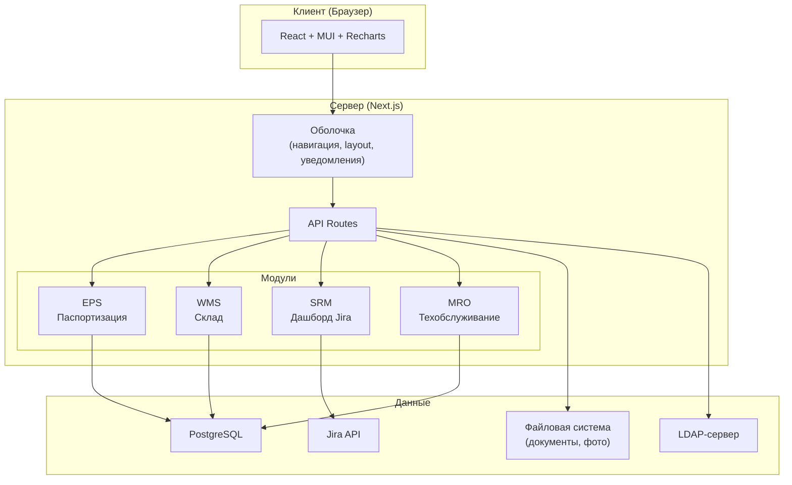
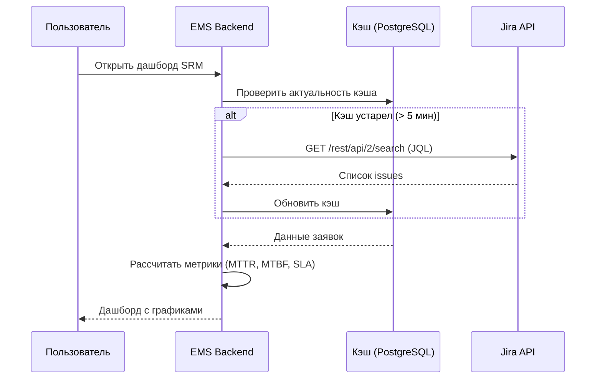

# Техническое задание: EMS — Equipment Management System

## 1. Общие сведения

### 1.1 Назначение системы
EMS (Equipment Management System) — модульная веб-система для управления оборудованием промышленного предприятия. Система объединяет паспортизацию оборудования, складской учёт, мониторинг заявок на ремонт и планирование технического обслуживания в едином интерфейсе.

### 1.2 Целевая аудитория
- **Инженеры и техники** — работа с оборудованием, складом, ТО
- **Руководители** — контроль метрик, SLA, отчёты
- **Складские работники** — приход/расход ТМЦ, инвентаризация
- **Администраторы** — настройка ролей, прав, справочников

### 1.3 Масштаб
- **Одновременных пользователей**: 5–20
- **Язык интерфейса**: русский
- **Развёртывание**: один сервер (PM2 + PostgreSQL на хосте)

---

## 2. Архитектура

### 2.1 Технологический стек

| Компонент | Технология |
|---|---|
| **Frontend** | Next.js 14+ (App Router), React 18+, TypeScript |
| **UI-Kit** | Material UI (MUI) v5+ |
| **Графики** | Recharts |
| **Backend** | Next.js API Routes (встроенный backend) |
| **ORM** | Prisma |
| **База данных** | PostgreSQL 15+ |
| **Аутентификация** | LDAP Bind + JWT-сессии |
| **Хранение файлов** | Локальная файловая система сервера |
| **Монорепозиторий** | Turborepo или Nx |
| **Процесс-менеджер** | PM2 |

### 2.2 Структура монорепозитория

```
ems/
├── apps/
│   └── web/                    # Основное Next.js-приложение (оболочка)
├── packages/
│   ├── shared/                 # Общие типы, утилиты, UI-компоненты
│   ├── auth/                   # Модуль аутентификации (LDAP + RBAC)
│   ├── eps/                    # Модуль паспортизации оборудования
│   ├── wms/                    # Модуль складского учёта
│   ├── srm/                    # Модуль дашборда Jira-заявок
│   └── mro/                    # Модуль техобслуживания
├── prisma/
│   └── schema.prisma           # Единая схема БД
├── turbo.json
├── package.json
└── tsconfig.json
```

### 2.3 Архитектурная схема



---

## 3. Оболочка (Shell)

### 3.1 Аутентификация и авторизация

#### Аутентификация (LDAP Bind)
1. Пользователь вводит логин и пароль
2. Система выполняет LDAP Bind с указанными credentials
3. При успешном Bind — создаётся JWT-сессия (httpOnly cookie)
4. При неудаче — ошибка «Неверный логин или пароль»

#### Авторизация (RBAC — Role-Based Access Control)
- **Роли хранятся в PostgreSQL**, привязка по LDAP-логину
- Предустановленные роли: `admin`, `guest`
- Администратор может **создавать новые роли** с гранулярными правами
- Права задаются на уровне:
  - **Модуль**: доступ к EPS / WMS / SRM / MRO
  - **Действие**: просмотр / создание / редактирование / удаление
  - **Раздел внутри модуля**: конкретные функции

#### Таблица прав (пример)

| Право (permission) | Описание |
|---|---|
| `eps.equipment.view` | Просмотр карточек оборудования |
| `eps.equipment.create` | Создание нового оборудования |
| `eps.equipment.edit` | Редактирование карточки |
| `eps.equipment.delete` | Удаление оборудования |
| `eps.documents.upload` | Загрузка документации |
| `wms.stock.view` | Просмотр остатков |
| `wms.operations.create` | Операции прихода/расхода |
| `wms.inventory.manage` | Инвентаризация |
| `srm.dashboard.view` | Просмотр дашборда Jira |
| `srm.reports.export` | Экспорт отчётов |
| `mro.schedule.view` | Просмотр графика ТО |
| `mro.schedule.edit` | Редактирование графика ТО |
| `admin.users.manage` | Управление пользователями |
| `admin.roles.manage` | Управление ролями |

### 3.2 Навигация и Layout

```
┌─────────────────────────────────────────────────────┐
│  [Логотип EMS]    [Поиск]     [🔔 3] [Пользователь ▾] │
├──────────┬──────────────────────────────────────────┤
│          │                                          │
│  📋 EPS  │     Контент текущего модуля              │
│  📦 WMS  │                                          │
│  📊 SRM  │                                          │
│  🔧 MRO  │                                          │
│          │                                          │
│  ⚙ Админ │                                          │
│          │                                          │
├──────────┴──────────────────────────────────────────┤
│  Подвал: версия, © организация                     │
└─────────────────────────────────────────────────────┘
```

- **Боковое меню**: отображает только доступные модули (по правам)
- **Верхняя панель**: поиск, уведомления (🔔), профиль пользователя
- **Боковое меню сворачивается** до иконок

### 3.3 Уведомления

- **Канал**: только внутри приложения
- **Центр уведомлений**: иконка 🔔 с badge (количество непрочитанных)
- **Типы уведомлений**:
  - Предстоящее ТО (MRO)
  - Минимальный остаток на складе (WMS)
  - Просроченные SLA (SRM)
  - Изменения в карточке оборудования (EPS, аудит)
- **Хранение**: таблица `notifications` в PostgreSQL
- **Пометка как прочитанное**: по клику или «Прочитать все»

### 3.4 Безопасность

| Мера | Реализация |
|---|---|
| **CSP** | Content-Security-Policy headers в Next.js middleware |
| **Rate Limiting** | Middleware на API Routes (например, `rate-limiter-flexible`) |
| **Аудит действий** | Логирование всех CUD-операций в таблицу `audit_log` |
| **CSRF** | SameSite cookies + CSRF-токен |
| **XSS** | React auto-escaping + CSP |
| **SQL Injection** | Prisma parameterized queries |
| **JWT** | httpOnly, Secure, SameSite=Strict, короткий TTL + refresh |

---

## 4. Модуль EPS — Паспортизация оборудования и документации

### 4.1 Функциональные требования

#### 4.1.1 Карточка оборудования
- **Основные поля**: название, инвентарный номер, серийный номер, производитель, модель, дата ввода в эксплуатацию, статус (в работе / на ремонте / списано / на складе)
- **Фотографии**: загрузка нескольких фото, превью, просмотр в галерее
- **Теги / категории**: гибкая классификация (например: «насос», «электродвигатель», «цех №3»)
- **Кастомные поля**: администратор может добавлять произвольные поля (текст, число, дата, выпадающий список, чекбокс) без изменения кода

#### 4.1.2 Документация
- Привязка документов к конкретному оборудованию
- Типы документов: схемы, инструкции, сертификаты, паспорта, акты
- Загрузка файлов: PDF, DOCX, XLSX, PNG, JPG
- Предпросмотр PDF в браузере
- Версионирование (при замене документа старая версия сохраняется)

#### 4.1.3 История изменений (Аудит)
- Фиксация **всех изменений** карточки: кто, когда, что изменилось (old value → new value)
- Просмотр истории в хронологическом порядке на карточке оборудования
- Фильтрация по полю, дате, пользователю

#### 4.1.4 Поиск и фильтрация
- **Полнотекстовый поиск** по названию, серийному номеру, инвентарному номеру
- **Фильтры**: по категории/тегу, статусу, производителю, дате ввода в эксплуатацию
- **Сортировка** по любому столбцу
- **Пагинация** на серверной стороне

#### 4.1.5 Кастомные поля
- Администратор определяет поля через UI: имя, тип, обязательность, значение по умолчанию
- Типы: `text`, `number`, `date`, `select` (с вариантами), `boolean`
- Значения хранятся в JSON-столбце или EAV-таблице
- Кастомные поля отображаются на карточке оборудования и доступны для фильтрации

### 4.2 Модель данных (Prisma)

```prisma
model Equipment {
  id              String   @id @default(uuid())
  name            String
  inventoryNumber String?  @unique
  serialNumber    String?
  manufacturer    String?
  model           String?
  status          EquipmentStatus @default(ACTIVE)
  commissionDate  DateTime?
  customFields    Json?    // Кастомные поля
  createdAt       DateTime @default(now())
  updatedAt       DateTime @updatedAt
  createdById     String
  
  createdBy       User     @relation(fields: [createdById], references: [id])
  tags            EquipmentTag[]
  documents       Document[]
  photos          Photo[]
  auditLogs       AuditLog[]
  spareParts      EquipmentSparePart[]
  maintenancePlans MaintenancePlan[]
}

enum EquipmentStatus {
  ACTIVE        // В работе
  UNDER_REPAIR  // На ремонте
  DECOMMISSIONED // Списано
  IN_STORAGE    // На складе
}

model Tag {
  id        String   @id @default(uuid())
  name      String   @unique
  color     String?
  equipment EquipmentTag[]
}

model EquipmentTag {
  equipmentId String
  tagId       String
  equipment   Equipment @relation(fields: [equipmentId], references: [id])
  tag         Tag       @relation(fields: [tagId], references: [id])
  @@id([equipmentId, tagId])
}

model CustomFieldDefinition {
  id           String   @id @default(uuid())
  name         String
  fieldType    FieldType
  isRequired   Boolean  @default(false)
  defaultValue String?
  options      Json?    // Для select: ["вариант1", "вариант2"]
  sortOrder    Int      @default(0)
  createdAt    DateTime @default(now())
}

enum FieldType {
  TEXT
  NUMBER
  DATE
  SELECT
  BOOLEAN
}

model Document {
  id           String   @id @default(uuid())
  equipmentId  String
  fileName     String
  filePath     String
  fileType     String   // MIME type
  fileSize     Int
  docType      DocumentType
  version      Int      @default(1)
  uploadedById String
  createdAt    DateTime @default(now())
  
  equipment    Equipment @relation(fields: [equipmentId], references: [id])
  uploadedBy   User      @relation(fields: [uploadedById], references: [id])
}

enum DocumentType {
  SCHEMA      // Схема
  MANUAL      // Инструкция
  CERTIFICATE // Сертификат
  PASSPORT    // Паспорт
  ACT         // Акт
  OTHER       // Прочее
}

model Photo {
  id           String   @id @default(uuid())
  equipmentId  String
  fileName     String
  filePath     String
  thumbnailPath String?
  sortOrder    Int      @default(0)
  uploadedById String
  createdAt    DateTime @default(now())
  
  equipment    Equipment @relation(fields: [equipmentId], references: [id])
  uploadedBy   User      @relation(fields: [uploadedById], references: [id])
}
```

---

## 5. Модуль WMS — Складской учёт

### 5.1 Функциональные требования

#### 5.1.1 Справочник номенклатуры
- **Автоформирование**: при операции прихода, если номенклатура не найдена — создаётся новая
- **Автокомплит**: при вводе названия — всплывающий список существующих позиций для выбора и автозаполнения
- Поля: наименование, артикул, единица измерения, категория, описание
- Категории номенклатуры (иерархия): запчасти, расходные материалы, инструмент и т.д.

#### 5.1.2 Операции прихода / расхода
- **Приход**: поступление ТМЦ на склад (поставщик, документ-основание, список позиций с количествами)
- **Расход**: списание со склада (получатель, основание, список позиций)
- **Связь с оборудованием**: при расходе можно указать, на какое оборудование списаны запчасти
- Каждая операция: дата, автор, комментарий, список позиций

#### 5.1.3 Остатки
- Отображение текущих остатков по каждому складу
- **Минимальный остаток** — при достижении формируется уведомление
- Фильтрация: по складу, категории, наименованию
- Автоматический пересчёт остатков по операциям

#### 5.1.4 Многоскладовость
- Несколько складов (основной, цеховые, и т.д.)
- Остатки ведутся отдельно по каждому складу
- Перемещение между складами как операция

#### 5.1.5 Связь с оборудованием
- Привязка номенклатуры к оборудованию (какие запчасти подходят к какому оборудованию)
- При просмотре карточки оборудования (EPS) — видны совместимые запчасти и их наличие на складе

#### 5.1.6 Инвентаризация
- Создание акта инвентаризации по складу
- Ввод фактических остатков
- Автоматический расчёт расхождений (факт vs учёт)
- Проведение корректировки остатков по результатам

### 5.2 Модель данных (Prisma)

```prisma
model Warehouse {
  id        String   @id @default(uuid())
  name      String
  location  String?
  isActive  Boolean  @default(true)
  createdAt DateTime @default(now())
  
  stockItems    StockItem[]
  operations    StockOperation[]
  inventories   Inventory[]
}

model NomenclatureCategory {
  id       String   @id @default(uuid())
  name     String
  parentId String?
  parent   NomenclatureCategory?  @relation("CategoryHierarchy", fields: [parentId], references: [id])
  children NomenclatureCategory[] @relation("CategoryHierarchy")
  items    Nomenclature[]
}

model Nomenclature {
  id           String   @id @default(uuid())
  name         String
  article      String?  @unique
  unit         String   // шт, кг, м, л
  categoryId   String?
  description  String?
  minStock     Int?     // Минимальный остаток (для уведомлений)
  createdAt    DateTime @default(now())
  
  category     NomenclatureCategory? @relation(fields: [categoryId], references: [id])
  stockItems   StockItem[]
  operationItems StockOperationItem[]
  equipmentLinks EquipmentSparePart[]
}

model StockItem {
  id              String   @id @default(uuid())
  warehouseId     String
  nomenclatureId  String
  quantity        Decimal  @default(0)
  
  warehouse       Warehouse    @relation(fields: [warehouseId], references: [id])
  nomenclature    Nomenclature @relation(fields: [nomenclatureId], references: [id])
  
  @@unique([warehouseId, nomenclatureId])
}

model StockOperation {
  id           String          @id @default(uuid())
  warehouseId  String
  type         OperationType
  date         DateTime        @default(now())
  counterparty String?         // Поставщик или получатель
  document     String?         // Документ-основание
  comment      String?
  createdById  String
  createdAt    DateTime        @default(now())
  
  warehouse    Warehouse       @relation(fields: [warehouseId], references: [id])
  createdBy    User            @relation(fields: [createdById], references: [id])
  items        StockOperationItem[]
}

enum OperationType {
  RECEIPT     // Приход
  ISSUE       // Расход
  TRANSFER    // Перемещение
  ADJUSTMENT  // Корректировка (инвентаризация)
}

model StockOperationItem {
  id              String   @id @default(uuid())
  operationId     String
  nomenclatureId  String
  quantity        Decimal
  equipmentId     String?  // К какому оборудованию списано
  
  operation       StockOperation @relation(fields: [operationId], references: [id])
  nomenclature    Nomenclature   @relation(fields: [nomenclatureId], references: [id])
  equipment       Equipment?     @relation(fields: [equipmentId], references: [id])
}

model EquipmentSparePart {
  equipmentId    String
  nomenclatureId String
  
  equipment      Equipment    @relation(fields: [equipmentId], references: [id])
  nomenclature   Nomenclature @relation(fields: [nomenclatureId], references: [id])
  
  @@id([equipmentId, nomenclatureId])
}

model Inventory {
  id           String   @id @default(uuid())
  warehouseId  String
  status       InventoryStatus @default(DRAFT)
  date         DateTime @default(now())
  createdById  String
  closedAt     DateTime?
  
  warehouse    Warehouse @relation(fields: [warehouseId], references: [id])
  createdBy    User      @relation(fields: [createdById], references: [id])
  items        InventoryItem[]
}

enum InventoryStatus {
  DRAFT       // Черновик
  IN_PROGRESS // В процессе
  COMPLETED   // Завершена
}

model InventoryItem {
  id              String   @id @default(uuid())
  inventoryId     String
  nomenclatureId  String
  expectedQty     Decimal  // Учётный остаток
  actualQty       Decimal? // Фактический остаток
  
  inventory       Inventory    @relation(fields: [inventoryId], references: [id])
  nomenclature    Nomenclature @relation(fields: [nomenclatureId], references: [id])
}
```

---

## 6. Модуль SRM — Дашборд заявок Jira

### 6.1 Функциональные требования

> [!IMPORTANT]
> SRM **не создаёт заявки** — это аналитический дашборд поверх Jira API. Заявки создаются и управляются в Jira.

#### 6.1.1 Просмотр заявок из Jira
- Отображение списка заявок из указанного Jira-проекта
- **Фильтры**: по статусу, приоритету, исполнителю, оборудованию, дате
- **Поиск** по номеру тикета и описанию
- Детальная карточка заявки (данные из Jira)
- Ссылка на оригинальный тикет в Jira

#### 6.1.2 Привязка к оборудованию (EPS)
- Маппинг Jira-тикетов к оборудованию по **кастомному полю Jira** (например, `customfield_10100` → инвентарный номер)
- На карточке оборудования в EPS — вкладка «Заявки» со списком связанных Jira-тикетов

#### 6.1.3 Метрики
- **MTTR** (Mean Time To Repair) — среднее время ремонта по оборудованию
- **MTBF** (Mean Time Between Failures) — среднее время между отказами
- Расчёт за период (неделя / месяц / квартал / год / произвольный)
- Отображение в карточке оборудования

#### 6.1.4 Графики и диаграммы (Recharts)
- **Количество заявок по времени** (линейный график, тренд)
- **Распределение по приоритетам** (круговая диаграмма)
- **Распределение по причинам / категориям** (столбчатая диаграмма)
- **Топ-10 оборудования по количеству заявок** (горизонтальная гистограмма)
- Все графики с выбором периода

#### 6.1.5 Контроль SLA
- Определение SLA-правил: время реакции и время решения по приоритетам
- Визуализация: сколько заявок выполнено в срок / просрочено
- Список просроченных заявок с подсветкой

#### 6.1.6 Экспорт отчётов
- **Excel (XLSX)**: таблица заявок с метриками
- **PDF**: сводный отчёт с графиками
- Выбор периода и фильтров перед экспортом

### 6.2 Интеграция с Jira API



- **Кэширование**: данные из Jira кэшируются в PostgreSQL с TTL 5 минут
- **Настройки**: URL Jira, проект, API-токен, кастомное поле для маппинга — в настройках администратора

---

## 7. Модуль MRO — Техническое обслуживание и ремонт

### 7.1 Функциональные требования

#### 7.1.1 Графики ППР (планово-предупредительный ремонт)
- Календарный план ТО по оборудованию
- **Периодичность**: ежедневно / еженедельно / ежемесячно / ежеквартально / ежегодно / по наработке
- Календарное представление (месяц / неделя) + список
- **Статусы ТО**: запланировано → в работе → выполнено / пропущено
- Автоматическое создание следующего ТО при завершении текущего

#### 7.1.2 Чек-листы обслуживания
- Шаблоны чек-листов по типу оборудования / виду ТО
- Пункты чек-листа: описание операции, тип (да/нет, числовое значение, текст)
- При выполнении ТО — заполнение чек-листа
- Сохранение заполненных чек-листов в истории

#### 7.1.3 Учёт запчастей (связь с WMS)
- При выполнении ТО — указание использованных запчастей
- Автоматическое списание со склада через WMS
- Отображение доступных запчастей из WMS при заполнении

#### 7.1.4 История ремонтов
- Полная история ТО и ремонтов по каждому оборудованию
- Источники: MRO (плановое ТО) + SRM/Jira (аварийные ремонты)
- Фильтрация по типу, дате, результату

#### 7.1.5 Уведомления
- Напоминание о предстоящем ТО (за N дней, настраиваемо)
- Уведомление о пропущенном ТО
- Отображение в центре уведомлений оболочки

#### 7.1.6 Создание заявок в Jira
- Из MRO можно создать заявку в Jira (если при ТО обнаружена неисправность)
- Заявка создаётся через Jira API с привязкой к оборудованию
- Далее отслеживается через SRM

### 7.2 Модель данных (Prisma)

```prisma
model MaintenancePlan {
  id            String   @id @default(uuid())
  equipmentId   String
  name          String   // Название ТО (ежемесячное ТО, ТО-1, и т.д.)
  description   String?
  frequency     MaintenanceFrequency
  intervalDays  Int?     // Для кастомного интервала
  checklistId   String?
  isActive      Boolean  @default(true)
  createdAt     DateTime @default(now())
  
  equipment     Equipment @relation(fields: [equipmentId], references: [id])
  checklist     ChecklistTemplate? @relation(fields: [checklistId], references: [id])
  schedules     MaintenanceSchedule[]
}

enum MaintenanceFrequency {
  DAILY
  WEEKLY
  MONTHLY
  QUARTERLY
  YEARLY
  CUSTOM
}

model MaintenanceSchedule {
  id              String   @id @default(uuid())
  planId          String
  scheduledDate   DateTime
  status          MaintenanceStatus @default(PLANNED)
  completedDate   DateTime?
  completedById   String?
  notes           String?
  jiraIssueKey    String?  // Если создана заявка в Jira
  createdAt       DateTime @default(now())
  
  plan            MaintenancePlan @relation(fields: [planId], references: [id])
  completedBy     User?    @relation(fields: [completedById], references: [id])
  checklistResult ChecklistResult?
  usedParts       MaintenanceUsedPart[]
}

enum MaintenanceStatus {
  PLANNED     // Запланировано
  IN_PROGRESS // В работе
  COMPLETED   // Выполнено
  MISSED      // Пропущено
  CANCELLED   // Отменено
}

model ChecklistTemplate {
  id        String   @id @default(uuid())
  name      String
  items     ChecklistTemplateItem[]
  plans     MaintenancePlan[]
  createdAt DateTime @default(now())
}

model ChecklistTemplateItem {
  id           String   @id @default(uuid())
  templateId   String
  description  String
  itemType     ChecklistItemType
  sortOrder    Int      @default(0)
  isRequired   Boolean  @default(true)
  
  template     ChecklistTemplate @relation(fields: [templateId], references: [id])
}

enum ChecklistItemType {
  BOOLEAN  // Да/Нет (выполнено/не выполнено)
  NUMERIC  // Числовое значение (давление, температура)
  TEXT     // Текстовое примечание
}

model ChecklistResult {
  id          String   @id @default(uuid())
  scheduleId  String   @unique
  items       Json     // [{itemId, value, note}]
  completedAt DateTime @default(now())
  
  schedule    MaintenanceSchedule @relation(fields: [scheduleId], references: [id])
}

model MaintenanceUsedPart {
  id              String   @id @default(uuid())
  scheduleId      String
  nomenclatureId  String
  quantity        Decimal
  warehouseId     String
  
  schedule        MaintenanceSchedule @relation(fields: [scheduleId], references: [id])
}
```

---

## 8. Общие модели данных

### 8.1 Пользователи и роли

```prisma
model User {
  id          String   @id @default(uuid())
  ldapLogin   String   @unique
  displayName String
  email       String?
  isActive    Boolean  @default(true)
  lastLoginAt DateTime?
  createdAt   DateTime @default(now())
  
  roles       UserRole[]
  // ... relations
}

model Role {
  id          String   @id @default(uuid())
  name        String   @unique  // admin, guest, engineer, ...
  displayName String
  description String?
  isSystem    Boolean  @default(false) // admin, guest — системные
  createdAt   DateTime @default(now())
  
  permissions RolePermission[]
  users       UserRole[]
}

model Permission {
  id          String   @id @default(uuid())
  code        String   @unique  // eps.equipment.view
  displayName String
  module      String   // eps, wms, srm, mro, admin
  
  roles       RolePermission[]
}

model RolePermission {
  roleId       String
  permissionId String
  
  role         Role       @relation(fields: [roleId], references: [id])
  permission   Permission @relation(fields: [permissionId], references: [id])
  
  @@id([roleId, permissionId])
}

model UserRole {
  userId String
  roleId String
  
  user   User @relation(fields: [userId], references: [id])
  role   Role @relation(fields: [roleId], references: [id])
  
  @@id([userId, roleId])
}
```

### 8.2 Аудит лог

```prisma
model AuditLog {
  id          String   @id @default(uuid())
  userId      String
  action      AuditAction
  entityType  String   // Equipment, Document, StockOperation, ...
  entityId    String
  changes     Json?    // { field: { old: "...", new: "..." } }
  ipAddress   String?
  createdAt   DateTime @default(now())
  
  user        User     @relation(fields: [userId], references: [id])
  
  @@index([entityType, entityId])
  @@index([userId])
  @@index([createdAt])
}

enum AuditAction {
  CREATE
  UPDATE
  DELETE
}
```

### 8.3 Уведомления

```prisma
model Notification {
  id          String   @id @default(uuid())
  userId      String
  title       String
  message     String
  type        NotificationType
  link        String?  // URL для перехода
  isRead      Boolean  @default(false)
  createdAt   DateTime @default(now())
  
  user        User     @relation(fields: [userId], references: [id])
  
  @@index([userId, isRead])
}

enum NotificationType {
  MAINTENANCE_UPCOMING  // Предстоящее ТО
  MAINTENANCE_MISSED    // Пропущенное ТО
  LOW_STOCK            // Минимальный остаток
  SLA_BREACH           // Нарушение SLA
  EQUIPMENT_CHANGED    // Изменение карточки оборудования
  SYSTEM               // Системное уведомление
}
```

---

## 9. API Endpoints

### 9.1 Аутентификация
| Метод | Путь | Описание |
|---|---|---|
| `POST` | `/api/auth/login` | LDAP-аутентификация, возврат JWT |
| `POST` | `/api/auth/logout` | Завершение сессии |
| `GET` | `/api/auth/me` | Текущий пользователь + права |
| `POST` | `/api/auth/refresh` | Обновление JWT |

### 9.2 EPS
| Метод | Путь | Описание |
|---|---|---|
| `GET` | `/api/eps/equipment` | Список оборудования (фильтры, пагинация) |
| `POST` | `/api/eps/equipment` | Создать оборудование |
| `GET` | `/api/eps/equipment/:id` | Карточка оборудования |
| `PATCH` | `/api/eps/equipment/:id` | Обновить оборудование |
| `DELETE` | `/api/eps/equipment/:id` | Удалить оборудование |
| `POST` | `/api/eps/equipment/:id/photos` | Загрузить фото |
| `POST` | `/api/eps/equipment/:id/documents` | Загрузить документ |
| `GET` | `/api/eps/equipment/:id/audit` | История изменений |
| `GET` | `/api/eps/tags` | Список тегов |
| `POST` | `/api/eps/tags` | Создать тег |
| `GET` | `/api/eps/custom-fields` | Определения кастомных полей |
| `POST` | `/api/eps/custom-fields` | Создать кастомное поле |

### 9.3 WMS
| Метод | Путь | Описание |
|---|---|---|
| `GET` | `/api/wms/warehouses` | Список складов |
| `POST` | `/api/wms/warehouses` | Создать склад |
| `GET` | `/api/wms/nomenclature` | Справочник номенклатуры (автокомплит) |
| `POST` | `/api/wms/nomenclature` | Создать номенклатуру |
| `GET` | `/api/wms/stock` | Остатки (фильтры: склад, категория) |
| `POST` | `/api/wms/operations` | Создать операцию (приход/расход/перемещение) |
| `GET` | `/api/wms/operations` | Список операций |
| `POST` | `/api/wms/inventories` | Создать инвентаризацию |
| `PATCH` | `/api/wms/inventories/:id` | Обновить / завершить инвентаризацию |
| `GET` | `/api/wms/equipment/:id/parts` | Совместимые запчасти для оборудования |

### 9.4 SRM
| Метод | Путь | Описание |
|---|---|---|
| `GET` | `/api/srm/issues` | Заявки из Jira (с кэшированием) |
| `GET` | `/api/srm/issues/:key` | Детали заявки Jira |
| `GET` | `/api/srm/metrics` | Метрики MTTR / MTBF |
| `GET` | `/api/srm/sla` | Контроль SLA |
| `GET` | `/api/srm/charts/trends` | Данные для графика трендов |
| `GET` | `/api/srm/charts/distribution` | Распределение по причинам |
| `GET` | `/api/srm/charts/top-equipment` | Топ оборудования по заявкам |
| `GET` | `/api/srm/export/excel` | Экспорт в Excel |
| `GET` | `/api/srm/export/pdf` | Экспорт в PDF |

### 9.5 MRO
| Метод | Путь | Описание |
|---|---|---|
| `GET` | `/api/mro/plans` | Планы ТО |
| `POST` | `/api/mro/plans` | Создать план ТО |
| `GET` | `/api/mro/schedule` | Календарь ТО (параметры: month, week) |
| `PATCH` | `/api/mro/schedule/:id` | Обновить статус ТО |
| `POST` | `/api/mro/schedule/:id/complete` | Завершить ТО (чек-лист + запчасти) |
| `GET` | `/api/mro/checklists` | Шаблоны чек-листов |
| `POST` | `/api/mro/checklists` | Создать шаблон |
| `GET` | `/api/mro/equipment/:id/history` | История ТО/ремонтов |
| `POST` | `/api/mro/schedule/:id/jira-issue` | Создать заявку в Jira из ТО |

### 9.6 Администрирование
| Метод | Путь | Описание |
|---|---|---|
| `GET` | `/api/admin/users` | Список пользователей |
| `PATCH` | `/api/admin/users/:id/roles` | Назначить роли |
| `GET` | `/api/admin/roles` | Список ролей |
| `POST` | `/api/admin/roles` | Создать роль |
| `PATCH` | `/api/admin/roles/:id` | Обновить роль (права) |
| `DELETE` | `/api/admin/roles/:id` | Удалить роль |
| `GET` | `/api/admin/permissions` | Список доступных прав |
| `GET` | `/api/admin/settings` | Системные настройки |
| `PATCH` | `/api/admin/settings` | Обновить настройки (Jira URL и т.д.) |
| `GET` | `/api/admin/audit-log` | Журнал аудита |

### 9.7 Уведомления
| Метод | Путь | Описание |
|---|---|---|
| `GET` | `/api/notifications` | Список уведомлений пользователя |
| `PATCH` | `/api/notifications/:id/read` | Отметить как прочитанное |
| `POST` | `/api/notifications/read-all` | Прочитать все |
| `GET` | `/api/notifications/unread-count` | Количество непрочитанных |

---

## 10. Этапы разработки

### Этап 1: Фундамент + Оболочка
- Инициализация монорепозитория (Turborepo + Next.js + Prisma)
- Настройка PostgreSQL, Prisma-схема (общие модели: User, Role, Permission, AuditLog, Notification)
- LDAP-аутентификация + JWT-сессии
- RBAC-middleware для API Routes
- Layout оболочки: боковое меню, верхняя панель, центр уведомлений
- Страница администрирования: управление пользователями и ролями
- Безопасность: CSP, rate limiting, аудит

### Этап 2: Модуль EPS
- Prisma-модели для оборудования, тегов, документов, фото, кастомных полей
- CRUD-операции для оборудования
- Загрузка и хранение фото / документов (файловая система)
- Кастомные поля (конфигурация через UI + хранение в JSON)
- Поиск, фильтрация, пагинация
- Аудит-лог изменений
- UI: список оборудования, карточка, формы

### Этап 3: Модуль WMS
- Prisma-модели для складов, номенклатуры, операций, остатков
- Справочник номенклатуры с автокомплитом
- Операции прихода / расхода / перемещения
- Автоматический расчёт остатков
- Многоскладовость
- Связь номенклатуры с оборудованием
- Инвентаризация
- Уведомления о минимальных остатках

### Этап 4: Модуль SRM
- Интеграция с Jira API (REST API v2)
- Кэширование данных Jira в PostgreSQL
- Маппинг Jira-тикетов к оборудованию EPS
- Расчёт метрик MTTR / MTBF
- Графики и диаграммы (Recharts)
- Контроль SLA
- Экспорт отчётов (Excel — xlsx, PDF — puppeteer/jspdf)

### Этап 5: Модуль MRO
- Prisma-модели для планов ТО, расписания, чек-листов
- Графики ППР (календарь)
- Шаблоны чек-листов
- Выполнение ТО с заполнением чек-листа + списание запчастей из WMS
- Автоматическое создание следующего ТО
- Создание заявок Jira из MRO
- Объединённая история (MRO + SRM) на карточке оборудования
- Уведомления о предстоящем / пропущенном ТО

---

## 11. Нефункциональные требования

| Требование | Значение |
|---|---|
| **Время загрузки страницы** | < 2 секунды |
| **Время ответа API** | < 500 мс (кроме Jira-запросов) |
| **Доступность** | 99% (рабочие часы) |
| **Резервное копирование** | pg_dump ежедневно |
| **Браузеры** | Chrome 90+, Firefox 90+, Edge 90+ |
| **Разрешение экрана** | Desktop-first, минимум 1280×720 |
| **Размер загружаемого файла** | До 50 МБ |
